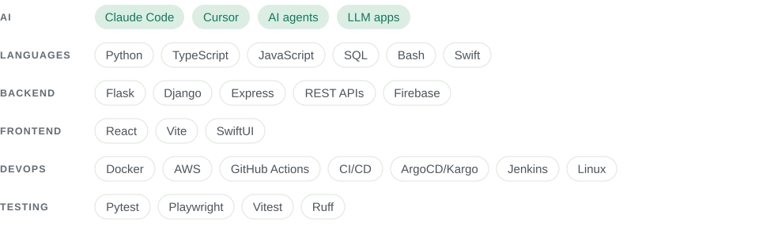

<a href="https://yoavsb25.github.io">
  <picture>
    <source media="(prefers-color-scheme: dark)" srcset="assets/banner-dark.svg">
    
  </picture>
</a>

  <a href="https://yoavsb25.github.io"><picture><source media="(prefers-color-scheme: dark)" srcset="assets/btn-website-dark.svg"></picture></a>
  <a href="https://www.linkedin.com/in/yoav-sborovsky-5a85b41a1/"><picture><source media="(prefers-color-scheme: dark)" srcset="assets/btn-linkedin-dark.svg"></picture></a>

### Selected work

  <a href="https://github.com/Yoavsb25/Yoavsb25.github.io"><picture><source media="(prefers-color-scheme: dark)" srcset="assets/card-portfolio-dark.svg"></picture></a>
  <a href="https://github.com/Yoavsb25/files-unifier"><picture><source media="(prefers-color-scheme: dark)" srcset="assets/card-files-unifier-dark.svg"></picture></a>
  <a href="https://github.com/Yoavsb25/fifa-songs-app"><picture><source media="(prefers-color-scheme: dark)" srcset="assets/card-pitch-star-dark.svg"></picture></a>
  <a href="https://github.com/Yoavsb25/claude-code-tools"><picture><source media="(prefers-color-scheme: dark)" srcset="assets/card-claude-code-tools-dark.svg"></picture></a>

### Tech stack

<picture>
  <source media="(prefers-color-scheme: dark)" srcset="assets/stack-dark.svg">
  
</picture>
