<a href="https://yoavsb25.github.io">
  <picture>
    <source media="(prefers-color-scheme: dark)" srcset="assets/header-dark.svg">
    
  </picture>
</a>

  <a href="https://yoavsb25.github.io"><b>Website</b></a> ·
  <a href="https://www.linkedin.com/in/yoav-sborovsky-5a85b41a1/"><b>LinkedIn</b></a> ·
  <a href="https://yoavsb25.github.io/yoav-sborovsky-cv.pdf"><b>Download CV</b></a> ·
  <a href="mailto:Yoavsb25@gmail.com"><b>Contact me</b></a>

I'm Yoav, an AI engineer in London. I take products from idea to production: I plan them, build them, test them, and keep improving them, with the care that makes AI dependable.

Most AI projects stall between the demo and the real product. I own the whole path, so nothing gets lost along the way.

**Plan → Foundations → Architect → Build → Test → Deploy → Iterate**

## Now

**Automation Engineer at [SysAid Technologies](https://www.sysaid.com)**, London · 2025 – present

- Built the platform the company uses to release its 29 software components, and automated release coordination across 14 repositories.
- Created an AI translation tool that covers 7 languages and made translation 75% faster.
- Built AI assistants (Claude Code) that help engineers find the root cause of incidents and failed tests faster.

## Selected work

**[This website, built with AI](https://github.com/Yoavsb25/Yoavsb25.github.io)** · Astro, TypeScript, Claude Code 
A portfolio built the way I build products: planned first, protected by automatic checks, and developed with AI assistants that follow the same rules as a human engineer. Every change must pass 7 checks before it goes live.

**[Files Unifier](https://github.com/Yoavsb25/files-unifier)** · Python, GitHub Actions 
A desktop tool, sold to a leading Israeli law firm, that turns a spreadsheet into merged, ready-to-send PDFs. Used there every day.

**[Pitch Star](https://github.com/Yoavsb25/fifa-songs-app)** · Swift, SwiftUI, Firebase 
A music quiz app for iPhone: name the year of 800+ FIFA soundtrack songs. Daily challenges and a subscription model, built solo from idea to finished app.

**[Claude Code tools](https://github.com/Yoavsb25/claude-code-tools)** · TypeScript, Node.js 
A registry of the Claude Code skills and automations I use every day, installable with one command.

[See the full case studies →](https://yoavsb25.github.io/#projects)

## Toolkit

**AI & automation:** Claude Code, Cursor, LLM integrations, AI agents and tools 
**Languages:** Python, TypeScript, JavaScript, SQL, Bash, Swift 
**Backend:** Flask, Django, Express, REST APIs 
**Infrastructure:** Docker, AWS, GitHub Actions, ArgoCD/Kargo (GitOps), Linux 
**Frontend:** React, Astro, Vite 
**Testing:** Pytest, Playwright, Vitest

## Background

**B.Sc. Computer Science & Entrepreneurship**, Reichman University · 2022 – 2025 
**Data Analyst**, Affilomania, Tel Aviv · 2020 – 2021

---

**Need an AI engineer who ships?** I'm looking for AI engineering roles in London or remote. [Contact me](mailto:Yoavsb25@gmail.com) or [download my CV](https://yoavsb25.github.io/yoav-sborovsky-cv.pdf).
